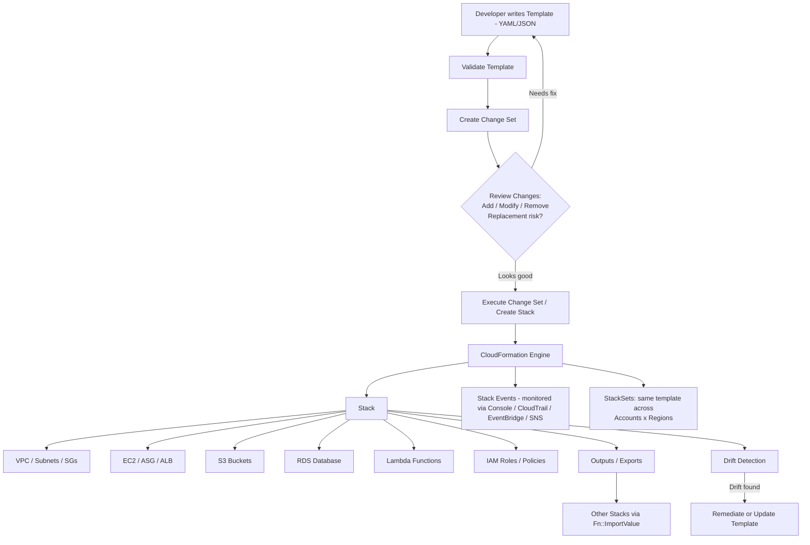
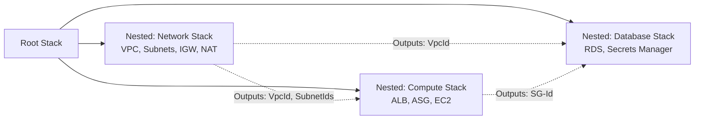

# 3.33 AWS CloudFormation — Complete Notes

> **Service type:** Management & Governance (Infrastructure as Code)
> **Scope:** Fresher-level interview prep + real-world hands-on reference
> **Convention used in this doc:** Wherever a CLI command is shown, the **GUI (AWS Console) steps are shown first**, CLI second.

---

## Table of Contents
1. [Overview](#1-overview)
2. [Core Components](#2-core-components)
3. [How to Create and Configure (GUI, CLI)](#3-how-to-create-and-configure-gui-cli)
4. [How to Use This Service Step by Step](#4-how-to-use-this-service-step-by-step)
5. [When to Use This Service](#5-when-to-use-this-service)
6. [Templates](#6-templates)
7. [Resources](#7-resources)
8. [Parameters](#8-parameters)
9. [Mappings](#9-mappings)
10. [Conditions](#10-conditions)
11. [Outputs](#11-outputs)
12. [Stack Lifecycle](#12-stack-lifecycle)
13. [Nested Stacks](#13-nested-stacks)
14. [Cross Stack References](#14-cross-stack-references)
15. [StackSets](#15-stacksets)
16. [Change Sets](#16-change-sets)
17. [Drift Detection](#17-drift-detection)
18. [Rollback Mechanism](#18-rollback-mechanism)
19. [CloudFormation Designer](#19-cloudformation-designer)
20. [Integration with IAM](#20-integration-with-iam)
21. [Integration with VPC](#21-integration-with-vpc)
22. [Integration with EC2](#22-integration-with-ec2)
23. [Integration with S3](#23-integration-with-s3)
24. [Integration with RDS](#24-integration-with-rds)
25. [Integration with Lambda](#25-integration-with-lambda)
26. [Security](#26-security)
27. [Monitoring](#27-monitoring)
28. [Troubleshooting](#28-troubleshooting)
29. [Interview Questions](#29-interview-questions)
30. [Enterprise Project Demo (GUI + CLI)](#30-enterprise-project-demo-gui--cli)
31. [Quick Revision Sheet](#31-quick-revision-sheet)
32. [Architecture Diagram](#32-architecture-diagram)

---

## 1. Overview

**AWS CloudFormation** is an **Infrastructure as Code (IaC)** service. You describe the AWS resources you want (EC2, S3, VPC, RDS, IAM, Lambda, etc.) in a text file called a **template** (JSON or YAML), and CloudFormation takes care of **provisioning, configuring, updating, and deleting** those resources in the correct order, automatically handling dependencies.

**Why it exists:**
- Manually clicking through the console to build infra is slow, error-prone, and not repeatable.
- CloudFormation lets you treat infrastructure like software — version it in Git, review it, reuse it.

**Key benefits:**
| Benefit | Explanation |
|---|---|
| Repeatable | Same template → same infra, every time, in any account/region |
| Automated | Handles resource creation order & dependency graph automatically |
| Safe | Automatic rollback on failure; Change Sets let you preview before applying |
| Free | You only pay for the underlying resources CloudFormation creates, not for the service itself |
| Auditable | Whole infra history lives as code (Git diffs) + CloudTrail logs every API call |
| Declarative | You declare the **desired end state**, not the steps to get there |

**Declarative vs Imperative:** CloudFormation is **declarative** — you say "I want a t3.micro EC2 instance with this security group," not "run these shell commands to launch one." Terraform is the closest non-AWS equivalent; CDK and SAM are AWS tools that **generate** CloudFormation templates under the hood.

---

## 2. Core Components

| Component | What it is |
|---|---|
| **Template** | The JSON/YAML file describing desired resources |
| **Stack** | A deployed instance of a template — the actual running collection of resources |
| **StackSet** | A stack deployed across multiple AWS accounts/regions from one place |
| **Resource** | An individual AWS object (EC2 instance, S3 bucket, etc.) defined in the template |
| **Parameter** | An input value passed into the template at deploy time |
| **Mapping** | A static lookup table (like a dictionary) inside the template |
| **Condition** | Logic that controls whether a resource/property is created |
| **Output** | A value exported from the stack (e.g., a URL, an ARN) for use elsewhere |
| **Change Set** | A preview of what will change before you actually update a stack |
| **Stack Policy** | JSON policy that protects specific resources from accidental updates/deletes |
| **Drift** | When a deployed resource is changed outside of CloudFormation (manually) |

---

## 3. How to Create and Configure (GUI, CLI)

### GUI (AWS Console) — Console first, always

**Steps:**
1. Go to **AWS Console → CloudFormation → Stacks → Create stack**.
2. Choose **"With new resources (standard)"**.
3. Under **Prerequisite - Prepare template**, choose **Template is ready**.
4. Under **Specify template**, choose **Upload a template file** (or **Amazon S3 URL**, or **Sync from Git**) → select your `.yaml`/`.json` file → **Next**.
5. **Specify stack details**: enter **Stack name**, fill in any **Parameters** the template asks for → **Next**.
6. **Configure stack options**: add **Tags**, optionally set an **IAM execution role**, configure **Stack failure options** (rollback behavior), **Stack policy**, **Notification options (SNS)** → **Next**.
7. **Review**: scroll down, check the **"I acknowledge that AWS CloudFormation might create IAM resources"** box if prompted (this is the **Capabilities** check) → **Submit**.
8. Watch progress on the **Events** tab; once status is `CREATE_COMPLETE`, check the **Resources** and **Outputs** tabs.

### CLI

```bash
# 1. Validate the template syntax first
aws cloudformation validate-template \
  --template-body file://my-template.yaml

# 2. Create the stack
aws cloudformation create-stack \
  --stack-name my-first-stack \
  --template-body file://my-template.yaml \
  --parameters ParameterKey=EnvType,ParameterValue=dev \
  --capabilities CAPABILITY_IAM \
  --tags Key=Project,Value=Learning

# 3. Watch status
aws cloudformation describe-stacks --stack-name my-first-stack
aws cloudformation wait stack-create-complete --stack-name my-first-stack
```

> Prerequisite: **AWS CLI v2 installed** + `aws configure` done with an IAM user/role that has CloudFormation + the underlying service permissions.

---

## 4. How to Use This Service Step by Step

1. **Write the template** — define `Resources` (mandatory), and optionally `Parameters`, `Mappings`, `Conditions`, `Outputs`.
2. **Validate** the template (`validate-template` in CLI, or the GUI does basic checks while uploading).
3. **Create a Change Set** (recommended for anything beyond a quick test) to preview what will happen.
4. **Execute the Change Set / Create the Stack.**
5. **Monitor** the `Events` tab / `describe-stack-events` until `CREATE_COMPLETE`.
6. **Use the Outputs** (e.g., a Load Balancer DNS name) in your application or in another stack.
7. **Update** the template when requirements change → create a new Change Set → review → execute.
8. **Detect Drift** periodically to make sure nobody changed resources manually.
9. **Delete the stack** when no longer needed — CloudFormation tears down resources in reverse dependency order.

---

## 5. When to Use This Service

**Use CloudFormation when:**
- You need **repeatable, version-controlled infrastructure** (dev/test/prod parity).
- You're deploying the **same architecture** across multiple accounts/regions (use with StackSets).
- You want **automatic rollback** if a deployment fails halfway.
- You need an **audit trail** of every infra change (via template diffs + CloudTrail).
- You're building a **multi-tier application** (VPC + EC2 + RDS + S3 + Lambda) and want it all created/destroyed together as one unit.

**Maybe not the best fit when:**
- You need a **multi-cloud** tool (AWS + Azure + GCP together) → Terraform is more common there.
- You want to write infra in a **general-purpose programming language** with loops/classes natively → consider **AWS CDK** (which compiles down to CloudFormation anyway).
- It's a **one-off, throwaway** resource for 5 minutes of testing → console click might be faster.

---

## 6. Templates

A template is the **blueprint**. It can be written in **YAML** (more common, supports comments) or **JSON**.

### Anatomy of a template

```yaml
AWSTemplateFormatVersion: "2010-09-09"   # Always this fixed string
Description: "Sample template - S3 bucket"
Metadata: {}                              # Extra info (e.g. for CloudFormation Designer)
Transform: AWS::Serverless-2016-10-31     # Optional - used for SAM / macros
Parameters: {}                            # Inputs
Mappings: {}                              # Static lookup tables
Conditions: {}                            # Conditional logic
Resources:                                # MANDATORY section
  MyBucket:
    Type: AWS::S3::Bucket
    Properties:
      BucketName: my-unique-bucket-name
Outputs: {}                               # Exported values
```

### Key Intrinsic Functions

| Function | Purpose | Example |
|---|---|---|
| `Ref` | Reference a parameter or resource's logical ID | `!Ref MyBucket` |
| `Fn::GetAtt` | Get an attribute of a resource | `!GetAtt MyInstance.PublicIp` |
| `Fn::Sub` | Substitute variables into a string | `!Sub "arn:aws:s3:::${MyBucket}"` |
| `Fn::Join` | Join a list into a string | `!Join [",", [a, b, c]]` |
| `Fn::ImportValue` | Import a value exported by another stack | `!ImportValue NetworkVpcId` |
| `Fn::FindInMap` | Look up a value in a Mapping | `!FindInMap [RegionMap, us-east-1, AMI]` |
| `Fn::If` / `Fn::Equals` | Conditional logic | `!If [IsProd, big, small]` |
| `Fn::Base64` | Encode a string (commonly UserData) | `!Base64 "#!/bin/bash..."` |
| `Fn::GetAZs` | List Availability Zones in a region | `!GetAZs ""` |
| `Fn::Select` / `Fn::Split` | Pick / split list items | `!Select [0, !GetAZs ""]` |
| `Fn::Cidr` | Generate CIDR blocks for subnetting | `!Cidr [10.0.0.0/16, 4, 8]` |

### Pseudo Parameters (built-in, no need to declare)
`AWS::Region`, `AWS::AccountId`, `AWS::StackName`, `AWS::StackId`, `AWS::Partition`, `AWS::URLSuffix`, `AWS::NoValue` (used to conditionally omit a property).

### GUI vs CLI for templates

**GUI:** Upload the template file directly in the **Create stack / Update stack** wizard, or use **CloudFormation Designer** to drag-drop resources and auto-generate the YAML/JSON.

**CLI:**
```bash
aws cloudformation validate-template --template-body file://template.yaml
```

---

## 7. Resources

This is the **only mandatory section**. Each resource has:
```yaml
Resources:
  LogicalID:
    Type: AWS::Service::ResourceType
    Properties:
      Key: Value
    DependsOn: OtherLogicalID        # optional - force ordering
    DeletionPolicy: Retain           # optional - Retain | Delete | Snapshot
    UpdateReplacePolicy: Retain      # optional - what happens to old resource on replacement
    CreationPolicy: {}               # optional - wait for signal (e.g. cfn-signal from EC2)
    UpdatePolicy: {}                 # optional - controls rolling updates (e.g. ASG)
```

- **`DependsOn`**: CloudFormation auto-detects most dependencies via `Ref`/`GetAtt`, but use `DependsOn` when there's no direct reference (e.g., resource A must exist before B for a non-obvious reason).
- **`DeletionPolicy: Retain`**: critical for stateful resources like S3 buckets or RDS databases you don't want auto-deleted with the stack.
- **Logical ID** vs **Physical ID**: Logical ID (`MyBucket`) is the name *inside the template*; Physical ID (`my-unique-bucket-name-xyz123`) is the actual resource name AWS assigns.

**GUI:** View all resources of a deployed stack under **Stack → Resources tab** (shows Logical ID, Physical ID, Type, Status).

**CLI:**
```bash
aws cloudformation describe-stack-resources --stack-name my-first-stack
```

---

## 8. Parameters

Parameters make templates **reusable** by accepting input at deploy time instead of hardcoding values.

```yaml
Parameters:
  EnvType:
    Type: String
    AllowedValues: [dev, staging, prod]
    Default: dev
    Description: Deployment environment
  InstanceType:
    Type: String
    Default: t3.micro
  DBPassword:
    Type: String
    NoEcho: true          # hides value in console/CLI output and logs
```

Common `Type` values: `String`, `Number`, `List<Number>`, `CommaDelimitedList`, AWS-specific types like `AWS::EC2::KeyPair::KeyName`, `AWS::EC2::VPC::Id`, `AWS::SSM::Parameter::Value<String>` (pulls live from Parameter Store).

**GUI:** When creating/updating a stack, the **"Specify stack details"** page auto-generates a form field for every parameter (dropdowns for `AllowedValues`, masked fields for `NoEcho`).

**CLI:**
```bash
aws cloudformation create-stack \
  --stack-name my-stack \
  --template-body file://template.yaml \
  --parameters ParameterKey=EnvType,ParameterValue=prod \
               ParameterKey=InstanceType,ParameterValue=t3.medium
```

---

## 9. Mappings

A **static**, hardcoded lookup table — resolved at template-parse time (no dynamic input needed).

```yaml
Mappings:
  RegionMap:
    us-east-1:
      AMI: ami-0abcdef1234567890
    ap-south-1:
      AMI: ami-0123456789abcdef0

Resources:
  MyInstance:
    Type: AWS::EC2::Instance
    Properties:
      ImageId: !FindInMap [RegionMap, !Ref "AWS::Region", AMI]
```

**Common use case:** picking the right AMI ID per region, since AMI IDs are region-specific.

**GUI:** Mappings aren't separately configurable in the console UI — they're baked into the template you upload. You'd only see their *resolved effect* in resource properties.

**CLI:** No dedicated command — it's part of `--template-body` validated via `validate-template`.

---

## 10. Conditions

Used to **conditionally create resources or set properties** based on parameter values.

```yaml
Conditions:
  IsProd: !Equals [!Ref EnvType, prod]

Resources:
  ProdOnlyBucket:
    Type: AWS::S3::Bucket
    Condition: IsProd
    Properties:
      BucketName: prod-only-bucket
```

Condition functions: `Fn::Equals`, `Fn::Not`, `Fn::And`, `Fn::Or`, used inside `Fn::If`.

**GUI:** Like Mappings, Conditions live inside the template; the console doesn't have a separate "conditions builder" — you just see resources skipped/created based on the parameters you choose in the wizard.

**CLI:** Same as above — validated as part of the template at `create-stack` / `update-stack` time.

---

## 11. Outputs

Values you want to **expose** after stack creation — URLs, ARNs, IDs — for humans to read or for **other stacks to import**.

```yaml
Outputs:
  BucketName:
    Description: Name of the S3 bucket
    Value: !Ref MyBucket
  VpcId:
    Value: !Ref MyVPC
    Export:
      Name: NetworkStack-VpcId     # makes it importable cross-stack
```

**GUI:** Stack → **Outputs tab** shows a table of Key, Value, Description, Export name.

**CLI:**
```bash
aws cloudformation describe-stacks \
  --stack-name my-first-stack \
  --query "Stacks[0].Outputs"
```

---

## 12. Stack Lifecycle

A stack moves through well-defined states:

| State | Meaning |
|---|---|
| `REVIEW_IN_PROGRESS` | Change set created for a new stack, not yet executed |
| `CREATE_IN_PROGRESS` → `CREATE_COMPLETE` | Stack being created → done |
| `CREATE_FAILED` | Something failed during creation |
| `ROLLBACK_IN_PROGRESS` → `ROLLBACK_COMPLETE` | Undoing a failed create |
| `ROLLBACK_FAILED` | Even rollback failed — needs manual fix |
| `UPDATE_IN_PROGRESS` → `UPDATE_COMPLETE` | Stack being updated → done |
| `UPDATE_ROLLBACK_IN_PROGRESS` → `UPDATE_ROLLBACK_COMPLETE` | Undoing a failed update |
| `DELETE_IN_PROGRESS` → `DELETE_COMPLETE` | Stack being deleted → done |
| `DELETE_FAILED` | Some resource refused to delete (e.g., non-empty S3 bucket) |

**Important gotcha:** A stack stuck in `ROLLBACK_COMPLETE` **cannot be updated** — you must **delete** it and **create it again**.

**GUI:** The **Stack detail page** shows current status at the top, with full history on the **Events** tab (timestamp, logical ID, status, status reason).

**CLI:**
```bash
aws cloudformation describe-stack-events --stack-name my-first-stack
aws cloudformation list-stacks --stack-status-filter CREATE_COMPLETE UPDATE_COMPLETE
```

---

## 13. Nested Stacks

A **nested stack** is a stack created as a **resource inside another (parent) stack**, using type `AWS::CloudFormation::Stack`. Used to **break large templates into reusable, manageable modules** (e.g., a `network.yaml`, `compute.yaml`, `database.yaml` all called from one `root.yaml`).

```yaml
Resources:
  NetworkStack:
    Type: AWS::CloudFormation::Stack
    Properties:
      TemplateURL: https://my-bucket.s3.amazonaws.com/network.yaml
      Parameters:
        EnvType: prod

  ComputeStack:
    Type: AWS::CloudFormation::Stack
    Properties:
      TemplateURL: https://my-bucket.s3.amazonaws.com/compute.yaml
      Parameters:
        VpcId: !GetAtt NetworkStack.Outputs.VpcId
```

> **Note:** The nested template file **must be uploaded to S3 first** — `TemplateURL` cannot point to a local file directly (the `aws cloudformation package` CLI command automates this upload step for you).

**GUI:** In the console, a nested stack shows up as a **resource of type `AWS::CloudFormation::Stack`** inside the parent; clicking it navigates you to the **child stack's own detail page**. There's no separate "create nested stack" button — it's just a resource in your template.

**CLI:**
```bash
# Package uploads local nested templates to S3 and rewrites TemplateURL automatically
aws cloudformation package \
  --template-file root.yaml \
  --s3-bucket my-cfn-artifacts-bucket \
  --output-template-file packaged.yaml

aws cloudformation deploy \
  --template-file packaged.yaml \
  --stack-name root-stack \
  --capabilities CAPABILITY_IAM
```

---

## 14. Cross Stack References

Lets a **completely separate, independently-managed stack** use a value from another stack — via **Export/Import**, not nesting.

**Stack A (exports):**
```yaml
Outputs:
  VpcId:
    Value: !Ref MyVPC
    Export:
      Name: SharedNetwork-VpcId
```

**Stack B (imports):**
```yaml
Resources:
  MySecurityGroup:
    Type: AWS::EC2::SecurityGroup
    Properties:
      VpcId: !ImportValue SharedNetwork-VpcId
```

**Nested Stack vs Cross-Stack Reference — key difference:**
| | Nested Stack | Cross-Stack Reference |
|---|---|---|
| Relationship | Parent owns child; deleted together | Independent stacks, loosely coupled |
| How linked | `AWS::CloudFormation::Stack` resource | `Export` + `Fn::ImportValue` |
| Use case | Modularizing ONE architecture | Sharing resources (e.g., a shared VPC) across MANY unrelated stacks |
| Constraint | N/A | An exported value **cannot be deleted/changed** while another stack imports it |

**GUI:** Stack → **Exports tab** (under CloudFormation left nav, there's a global **"Exports"** page listing every exported value across all stacks in the region, with the importing stack visible if you try to delete it).

**CLI:**
```bash
aws cloudformation list-exports
aws cloudformation list-imports --export-name SharedNetwork-VpcId
```

---

## 15. StackSets

**StackSets** deploy the **same stack across multiple AWS accounts and/or multiple regions** from a single operation — essential for enterprises managing landing zones, guardrails, or standard resources (e.g., a security baseline) across dozens of accounts.

**Two permission models:**
- **Self-managed:** You manually create an `AWSCloudFormationStackSetAdministrationRole` (in the admin account) and `AWSCloudFormationStackSetExecutionRole` (in each target account).
- **Service-managed:** Uses **AWS Organizations** — CloudFormation automatically handles roles; supports auto-deployment to new accounts as they join an OU.

**GUI:**
1. **CloudFormation → StackSets → Create StackSet.**
2. Choose template → choose permission model (Self-managed / Service-managed).
3. Specify StackSet details + parameters.
4. **Set deployment options**: choose target **Accounts** (or OUs) and **Regions**, deployment order, concurrency.
5. Review → **Submit**. Track progress in the **Stack instances** tab.

**CLI:**
```bash
aws cloudformation create-stack-set \
  --stack-set-name baseline-iam \
  --template-body file://baseline.yaml \
  --permission-model SERVICE_MANAGED \
  --auto-deployment Enabled=true,RetainStacksOnAccountRemoval=false

aws cloudformation create-stack-instances \
  --stack-set-name baseline-iam \
  --deployment-targets OrganizationalUnitIds=ou-1234-abcd \
  --regions us-east-1 ap-south-1
```

---

## 16. Change Sets

A **Change Set** is a **preview** of what will happen if you update a stack — it shows additions, modifications, removals, and **whether a resource will be replaced (downtime!) or updated in place** — **without actually applying anything** until you explicitly execute it.

**Why it matters:** Some property changes force **resource replacement** (e.g., changing an RDS instance's `Engine`), which means downtime/data loss risk. Change Sets surface this *before* you commit.

**GUI:**
1. Stack → **Change sets tab → Create change set.**
2. Upload the updated template → fill new parameter values → **Create change set.**
3. Review the **Changes** table (Action: Add/Modify/Remove, Replacement: True/False/Conditional).
4. If it looks correct → **Execute change set.**

**CLI:**
```bash
aws cloudformation create-change-set \
  --stack-name my-first-stack \
  --change-set-name update-instance-type \
  --template-body file://template-v2.yaml \
  --parameters ParameterKey=InstanceType,ParameterValue=t3.large

aws cloudformation describe-change-set \
  --stack-name my-first-stack \
  --change-set-name update-instance-type

aws cloudformation execute-change-set \
  --stack-name my-first-stack \
  --change-set-name update-instance-type
```

---

## 17. Drift Detection

Detects when a resource's **actual configuration** has diverged from what's **defined in the template** — i.e., someone manually edited it in the console/CLI outside of CloudFormation.

**Drift statuses:** `IN_SYNC`, `MODIFIED`, `DELETED`, `NOT_CHECKED`.

**GUI:**
1. Stack → **Stack actions → Detect drift.**
2. Wait for detection to finish (a few seconds to minutes depending on resource count).
3. **Drift status** column updates per resource; click a drifted resource to see **Expected vs Actual** property values side by side.

**CLI:**
```bash
aws cloudformation detect-stack-drift --stack-name my-first-stack

# Use the returned StackDriftDetectionId to check progress
aws cloudformation describe-stack-drift-detection-status \
  --stack-drift-detection-id <id-from-above>

# See exactly what drifted
aws cloudformation describe-stack-resource-drifts \
  --stack-name my-first-stack
```

> **Best practice:** Run drift detection on a schedule (e.g., via EventBridge + Lambda) for compliance-sensitive stacks, since manual console changes are a common source of "it works differently than the template says" bugs.

---

## 18. Rollback Mechanism

By **default**, if any resource fails during `CREATE` or `UPDATE`, CloudFormation **automatically rolls back** — it deletes (on create-fail) or reverts (on update-fail) everything it had already provisioned, to avoid leaving a half-built, inconsistent stack.

**Key options:**
- `--disable-rollback` (CLI) / unchecking auto-rollback (GUI advanced options) — useful for **debugging**, since the failed resources stay around so you can inspect the actual error instead of them vanishing.
- **Rollback triggers**: you can attach **CloudWatch Alarms** so that even if resources are created "successfully" but then misbehave (e.g., high error rate right after deploy), CloudFormation still rolls back the *update*.
- A failed **rollback itself** can fail too → state becomes `ROLLBACK_FAILED` / `UPDATE_ROLLBACK_FAILED`, usually needing manual intervention (e.g., the resource it's trying to revert was deleted outside CFN).

**GUI:** During **Create stack → Configure stack options → Stack failure options**, choose: *"Roll back all stack resources"* (default) vs *"Preserve successfully provisioned resources"* (keeps what worked, for easier debugging).

**CLI:**
```bash
aws cloudformation create-stack \
  --stack-name debug-stack \
  --template-body file://template.yaml \
  --disable-rollback
```

---

## 19. CloudFormation Designer

A **visual, drag-and-drop GUI tool** (inside the console) for building and visualizing templates as a **node graph** — resources as boxes, connections as lines showing dependencies (via `Ref`/`GetAtt`).

**When it's useful:** Visualizing a complex existing template's resource relationships, or quickly dragging out a simple architecture without hand-writing YAML.
**Limitation:** Most experienced engineers still prefer hand-writing YAML in an IDE (with linting/snippets) for anything non-trivial — Designer is more of a learning/visualization aid than a daily production tool.

**GUI:**
1. **CloudFormation → Designer** (accessible from the stack's template viewer too, via **"View in Designer"**).
2. Drag resource icons from the left palette onto the canvas, connect them, fill in properties in the bottom panel.
3. Designer auto-generates the corresponding YAML/JSON in real time — **Save** to download the template.

**CLI:** Not applicable — Designer is a GUI-only authoring tool (the *output* is just a normal template file usable with all the standard CLI commands above).

---

## 20. Integration with IAM

CloudFormation can **create IAM resources** (Users, Roles, Policies, Instance Profiles) directly in a template — and because that's a security-sensitive action, AWS forces you to **explicitly acknowledge it**.

```yaml
Resources:
  AppRole:
    Type: AWS::IAM::Role
    Properties:
      AssumeRolePolicyDocument:
        Version: "2012-10-17"
        Statement:
          - Effect: Allow
            Principal: { Service: ec2.amazonaws.com }
            Action: sts:AssumeRole
      Policies:
        - PolicyName: S3ReadOnly
          PolicyDocument:
            Version: "2012-10-17"
            Statement:
              - Effect: Allow
                Action: s3:GetObject
                Resource: "*"
```

- **Capabilities:** `CAPABILITY_IAM` (auto-generated role/policy names) or `CAPABILITY_NAMED_IAM` (you specify custom names like `RoleName: MyCustomRole`) — required or the API call is rejected.
- You can also assign a **CloudFormation Service Role** to a stack — this decouples "who can run `create-stack`" from "what permissions the stack itself uses," so a developer can deploy infra without personally holding admin IAM rights.

**GUI:** The **"I acknowledge that AWS CloudFormation might create IAM resources"** checkbox appears automatically on the **Review** page whenever your template contains IAM resources.

**CLI:**
```bash
aws cloudformation create-stack \
  --stack-name iam-demo \
  --template-body file://iam-template.yaml \
  --capabilities CAPABILITY_NAMED_IAM
```

---

## 21. Integration with VPC

CloudFormation commonly provisions entire **network layers**: VPC, subnets, route tables, Internet Gateway, NAT Gateway, Security Groups.

```yaml
Resources:
  MyVPC:
    Type: AWS::EC2::VPC
    Properties:
      CidrBlock: 10.0.0.0/16
      EnableDnsSupport: true
      EnableDnsHostnames: true

  PublicSubnet:
    Type: AWS::EC2::Subnet
    Properties:
      VpcId: !Ref MyVPC
      CidrBlock: 10.0.1.0/24
      AvailabilityZone: !Select [0, !GetAZs ""]
      MapPublicIpOnLaunch: true
```

`Fn::GetAZs` and `Fn::Cidr` are heavily used here to make subnet creation **region-agnostic** (auto-pick AZs, auto-carve CIDR ranges).

**GUI:** View created network resources normally under **VPC console** (CloudFormation doesn't have a special VPC view — once created, it's a regular VPC resource, just **tagged/owned** by the stack and shown on the stack's **Resources tab**).

**CLI:**
```bash
aws cloudformation describe-stack-resources \
  --stack-name network-stack \
  --logical-resource-id MyVPC
```

---

## 22. Integration with EC2

```yaml
Resources:
  WebServer:
    Type: AWS::EC2::Instance
    Properties:
      InstanceType: t3.micro
      ImageId: !FindInMap [RegionMap, !Ref "AWS::Region", AMI]
      SubnetId: !Ref PublicSubnet
      SecurityGroupIds: [!Ref WebSG]
      UserData:
        Fn::Base64: !Sub |
          #!/bin/bash
          yum install -y httpd
          systemctl start httpd
    CreationPolicy:
      ResourceSignal:
        Timeout: PT5M       # waits for cfn-signal from inside the instance
```

- `UserData` + `Fn::Base64`: bootstraps the instance on first boot.
- `CreationPolicy` + `cfn-signal`: lets CloudFormation **wait** until the app inside the instance is actually ready (not just "instance launched") before marking it `CREATE_COMPLETE`.
- For **Auto Scaling Groups**, `UpdatePolicy` (e.g., `AutoScalingRollingUpdate`) controls how instances are replaced during updates without downtime.

**GUI:** EC2 instances created by a stack are visible in the normal **EC2 console**, tagged with `aws:cloudformation:stack-name`; the **stack's Resources tab** links directly to them.

**CLI:**
```bash
aws cloudformation describe-stack-resource \
  --stack-name compute-stack \
  --logical-resource-id WebServer
```

---

## 23. Integration with S3

S3 is used in **two distinct ways**:
1. **As a deployed resource** (a bucket your app uses).
2. **As CloudFormation's own artifact store** — templates for nested stacks, Lambda deployment packages, and StackSet templates often must live in S3 first.

```yaml
Resources:
  AppBucket:
    Type: AWS::S3::Bucket
    DeletionPolicy: Retain     # don't delete bucket/data if stack is deleted
    Properties:
      BucketName: !Sub "app-data-${AWS::AccountId}-${AWS::Region}"
      VersioningConfiguration:
        Status: Enabled
```

**GUI:** Use **S3 console** to manually create the artifact bucket once (or let `aws cloudformation package` create one for you); deployed buckets show in the normal **S3 console**.

**CLI:**
```bash
# package uploads local files (nested templates, Lambda zips) to S3 automatically
aws cloudformation package \
  --template-file root.yaml \
  --s3-bucket my-cfn-artifacts \
  --output-template-file packaged.yaml
```

---

## 24. Integration with RDS

```yaml
Resources:
  DBSubnetGroup:
    Type: AWS::RDS::DBSubnetGroup
    Properties:
      SubnetIds: [!Ref PrivateSubnetA, !Ref PrivateSubnetB]
      DBSubnetGroupDescription: Subnets for RDS

  MyDatabase:
    Type: AWS::RDS::DBInstance
    DeletionPolicy: Snapshot     # take a final snapshot before deleting
    Properties:
      Engine: mysql
      DBInstanceClass: db.t3.micro
      AllocatedStorage: 20
      MasterUsername: admin
      MasterUserPassword: !Sub "{{resolve:secretsmanager:${DBSecret}:SecretString:password}}"
      DBSubnetGroupName: !Ref DBSubnetGroup
      VPCSecurityGroups: [!Ref DBSG]
```

- **`DeletionPolicy: Snapshot`** is critical for production databases — guarantees a backup exists even if the stack is deleted.
- **Dynamic references** (`{{resolve:secretsmanager:...}}` or `{{resolve:ssm:...}}`) let you pull secrets at **deploy time** instead of hardcoding passwords in the template (which would otherwise sit in plaintext in your Git history).

**GUI:** RDS instances appear in the normal **RDS console**; password/secret fields are masked (`NoEcho`) wherever shown in the stack's Parameters/Resources view.

**CLI:**
```bash
aws cloudformation describe-stack-resource \
  --stack-name db-stack \
  --logical-resource-id MyDatabase
```

---

## 25. Integration with Lambda

```yaml
Transform: AWS::Serverless-2016-10-31   # enables SAM shorthand (optional)

Resources:
  MyFunction:
    Type: AWS::Lambda::Function
    Properties:
      FunctionName: my-cfn-function
      Runtime: python3.12
      Handler: index.handler
      Role: !GetAtt LambdaExecRole.Arn
      Code:
        S3Bucket: my-cfn-artifacts
        S3Key: function.zip
      Environment:
        Variables:
          ENV: !Ref EnvType
```

- Lambda **code itself** must be zipped and pointed to via S3 (`aws cloudformation package` automates the zip-and-upload step for inline local code).
- **`AWS::Serverless-2016-10-31` Transform** (SAM) lets you use shorthand resource types like `AWS::Serverless::Function`, which CloudFormation expands into full Lambda+IAM+API Gateway resources behind the scenes — this is what powers the **SAM CLI**.

**GUI:** Deployed functions appear in the **Lambda console**; you can view/test them there, but the *source of truth* for their config remains the CloudFormation template.

**CLI:**
```bash
aws cloudformation describe-stack-resource \
  --stack-name serverless-stack \
  --logical-resource-id MyFunction
```

---

## 26. Security

| Area | Practice |
|---|---|
| **Least privilege** | Use a scoped **CloudFormation Service Role** so the stack only has permissions to create what it needs — not the deployer's full permissions |
| **Capabilities** | Forces explicit human acknowledgment before IAM resources are auto-created — prevents silent privilege escalation |
| **Sensitive parameters** | Use `NoEcho: true` for passwords/secrets so they don't appear in console output, CLI output, or `describe-stacks` |
| **Dynamic references** | Pull secrets from **Secrets Manager** / **SSM Parameter Store** at deploy time instead of hardcoding in the template |
| **Stack Policy** | A resource-level JSON policy that blocks specific resources (e.g., a production RDS instance) from being updated/replaced/deleted during a stack update, even if the template says to |
| **Drift Detection** | Periodically verify nobody bypassed CFN and manually loosened a security group, etc. |
| **CloudTrail** | Every CloudFormation API call (`CreateStack`, `UpdateStack`, `DeleteStack`...) is logged for audit |
| **Termination Protection** | Prevents accidental `delete-stack` on critical stacks (must be explicitly disabled first) |

**Sample Stack Policy** (deny updates to a specific resource):
```json
{
  "Statement": [
    {
      "Effect": "Deny",
      "Action": "Update:*",
      "Principal": "*",
      "Resource": "LogicalResourceId/ProdDatabase"
    },
    {
      "Effect": "Allow",
      "Action": "Update:*",
      "Principal": "*",
      "Resource": "*"
    }
  ]
}
```

**GUI:** Stack → **Stack actions → Edit termination protection** / **Edit stack policy**.

**CLI:**
```bash
aws cloudformation update-termination-protection \
  --stack-name prod-stack \
  --enable-termination-protection

aws cloudformation set-stack-policy \
  --stack-name prod-stack \
  --stack-policy-body file://stack-policy.json
```

---

## 27. Monitoring

| Tool | What it gives you |
|---|---|
| **Events tab (GUI) / `describe-stack-events` (CLI)** | Real-time, ordered log of every resource's create/update/delete status and failure reason |
| **CloudTrail** | Full audit log of who called which CloudFormation API, when |
| **SNS Notifications** | Attach an SNS topic to a stack → get notified the moment status changes (e.g., `CREATE_COMPLETE`, `UPDATE_FAILED`) |
| **EventBridge** | Built-in event source `aws.cloudformation` — trigger Lambda/Step Functions on stack status changes (great for automated drift checks or Slack alerts) |
| **CloudFormation Hooks** | Run custom validation logic *before* a resource is provisioned (e.g., block public S3 buckets) |

**GUI:** Stack → **Events tab** (chronological); also configure **SNS topic ARNs** under **Configure stack options → Notification options** when creating/updating.

**CLI:**
```bash
aws cloudformation create-stack \
  --stack-name monitored-stack \
  --template-body file://template.yaml \
  --notification-arns arn:aws:sns:ap-south-1:123456789012:cfn-alerts

aws cloudformation describe-stack-events --stack-name monitored-stack
```

---

## 28. Troubleshooting

| Problem | Likely Cause | Fix |
|---|---|---|
| Stack stuck in `ROLLBACK_COMPLETE` | Initial create failed | Cannot update — must **delete** stack, fix template, **recreate** |
| `CREATE_FAILED` — "Insufficient permissions" | The IAM role/user running the stack lacks permission to create that resource type | Add the missing permission, or fix the **CloudFormation Service Role** |
| `DELETE_FAILED` on an S3 bucket | Bucket is **not empty** | Empty the bucket manually first, or use a **Custom Resource/Lambda** to auto-empty on delete |
| "No updates are to be performed" | Template submitted is byte-identical to current stack | Confirm you actually changed something; check whitespace-only diffs are ignored |
| Resource **replaced unexpectedly** (downtime) | Changed an immutable property (e.g., RDS `Engine`) | Always run a **Change Set** first — check the "Replacement" column |
| Circular dependency error | Two resources reference each other via `Ref`/`GetAtt`/`DependsOn` | Break the cycle — often fixable with a separate resource (e.g., attach SG rule separately instead of inline) |
| `Export … cannot be deleted as it is in use` | Another stack still does `Fn::ImportValue` on it | Remove the import in the dependent stack first, then delete/update the exporting stack |
| Update hangs for a long time | Often a resource (e.g., ASG, RDS) genuinely takes time, or a `CreationPolicy`/`cfn-signal` is never received | Check the resource's own console status; verify `cfn-signal` script actually runs and the timeout is long enough |

**GUI:** Always check the **Events tab** first — sort by time, find the **first** `_FAILED` event (later failures are usually *consequences*, not the root cause).

**CLI:**
```bash
aws cloudformation describe-stack-events --stack-name my-stack \
  --query "StackEvents[?ResourceStatus=='CREATE_FAILED']"
```

---

## 29. Interview Questions

**Q1. What is AWS CloudFormation?**
A service to provision and manage AWS resources using declarative templates (Infrastructure as Code).

**Q2. What's the difference between CloudFormation and Terraform?**
CloudFormation is AWS-native, free, deeply integrated (Capabilities, StackSets, drift detection); Terraform is multi-cloud, open-source, and uses its own state file rather than a managed stack concept.

**Q3. What's the difference between a Template and a Stack?**
Template = the code/blueprint (file). Stack = the actual deployed/running set of resources created from that template.

**Q4. What happens if a resource fails to create?**
By default, CloudFormation automatically **rolls back** — deleting everything created so far in that operation, to avoid a half-built state.

**Q5. What is a Change Set?**
A dry-run preview showing exactly what will be Added/Modified/Removed — and whether a Modify means in-place update or full replacement — before you commit to an actual update.

**Q6. What are Capabilities (CAPABILITY_IAM) and why are they required?**
A safety check: since templates can create IAM resources (which affect security), AWS requires explicit acknowledgment before allowing the stack to proceed, preventing silent privilege escalation.

**Q7. Nested Stack vs Cross-Stack Reference?**
Nested = parent owns child, deleted/managed together (`AWS::CloudFormation::Stack`). Cross-stack = independent stacks sharing values via `Export`/`Fn::ImportValue`.

**Q8. What is Drift Detection?**
Identifies when a deployed resource's real-world configuration no longer matches what the template defines (usually due to a manual console/CLI change).

**Q9. What is a StackSet used for?**
Deploying the same stack consistently across many AWS accounts and/or regions from one place — common for security baselines/guardrails in large organizations.

**Q10. How do you protect a critical resource (e.g., production DB) from being deleted by mistake?**
`DeletionPolicy: Retain` (or `Snapshot` for databases) on the resource, plus a **Stack Policy** denying updates to that Logical ID, plus stack-level **Termination Protection**.

**Q11. Can you update an immutable property of a resource? What happens?**
No — CloudFormation will **replace** the resource (delete old, create new) instead of updating in place, which can cause downtime/data loss. Always check via a Change Set first.

**Q12. How do you pass a secret/password securely into a template?**
Use `NoEcho: true` for the parameter, or better, a **dynamic reference** (`{{resolve:secretsmanager:...}}`) so the actual secret never appears in the template or parameter input at all.

**Q13. What's the difference between `Ref` and `Fn::GetAtt`?**
`Ref` typically returns a resource's primary identifier (e.g., bucket name); `Fn::GetAtt` returns a *specific named attribute* (e.g., `MyInstance.PublicIp`, `MyBucket.Arn`).

**Q14. Why would a stack be stuck in `ROLLBACK_COMPLETE` and what do you do?**
It means the *original* create failed and rollback finished — but you cannot update a stack in this state; you must delete it and create a fresh one.

**Q15. What's a Stack Policy vs an IAM Policy?**
IAM policy controls **who** (which principal) can call CloudFormation APIs at all. Stack Policy controls **which resources within an already-permitted update** are protected from being changed.

---

## 30. How to use this service in enterprise level project with demo {GUI + CLI}

### Scenario
Deploy a standard **3-tier web app baseline**: VPC (network tier) → EC2/ASG behind an ALB (compute tier) → RDS (database tier) — as **modular nested stacks**, callable repeatably for every new environment (dev/staging/prod), and replicable across regions via a StackSet for DR.

### Enterprise pattern used
```
root-stack.yaml
 ├── network-stack.yaml   (VPC, subnets, IGW, NAT, route tables)
 ├── compute-stack.yaml   (ALB, ASG, Launch Template, Security Groups)
 └── database-stack.yaml  (RDS, DB Subnet Group, Secrets Manager secret)
```
Each child template exports its key Outputs; the root passes them down as Parameters between nested stacks — this is the standard enterprise modularization pattern (separate **network team's** template from the **app team's** template).

### Step-by-step demo

**1. Store all child templates in a versioned S3 artifact bucket (one-time setup)**

GUI: **S3 → Create bucket** → name it `enterprise-cfn-artifacts-<account-id>` → enable **Versioning**.

CLI:
```bash
aws s3 mb s3://enterprise-cfn-artifacts-123456789012
aws s3api put-bucket-versioning \
  --bucket enterprise-cfn-artifacts-123456789012 \
  --versioning-configuration Status=Enabled
```

**2. Validate every template before packaging**

GUI: Open each file in **CloudFormation → Stacks → Create stack → Upload a template file**, get to the parameters page (this surfaces syntax errors), then cancel out — or use **Designer's "Validate"** button.

CLI:
```bash
for f in network-stack.yaml compute-stack.yaml database-stack.yaml root-stack.yaml; do
  aws cloudformation validate-template --template-body file://$f
done
```

**3. Package the root stack (uploads nested templates to S3, rewrites `TemplateURL`s)**

GUI: There's no GUI equivalent for packaging — this step is CLI-only because it involves local file uploads; the GUI only supports a single template upload at a time, not a multi-file nested set.

CLI:
```bash
aws cloudformation package \
  --template-file root-stack.yaml \
  --s3-bucket enterprise-cfn-artifacts-123456789012 \
  --output-template-file packaged-root.yaml
```

**4. Preview with a Change Set (enterprise best practice — never deploy blind)**

GUI: **CloudFormation → Create stack → With new resources** → upload `packaged-root.yaml` → fill Parameters (`EnvType=prod`, `DBInstanceClass=db.t3.medium`, etc.) → at the Review step choose **"Create change set"** instead of "Submit" → inspect the **Changes** table.

CLI:
```bash
aws cloudformation create-change-set \
  --stack-name prod-3tier-app \
  --change-set-name initial-deploy \
  --template-body file://packaged-root.yaml \
  --parameters ParameterKey=EnvType,ParameterValue=prod \
  --capabilities CAPABILITY_NAMED_IAM

aws cloudformation describe-change-set \
  --stack-name prod-3tier-app \
  --change-set-name initial-deploy
```

**5. Execute and monitor**

GUI: Click **Execute change set** → watch the **Events tab**; nested stacks (`NetworkStack`, `ComputeStack`, `DatabaseStack`) appear as their own rows — click through to see each child stack's own events.

CLI:
```bash
aws cloudformation execute-change-set \
  --stack-name prod-3tier-app \
  --change-set-name initial-deploy

aws cloudformation wait stack-create-complete --stack-name prod-3tier-app
```

**6. Replicate to a DR region using a StackSet (enterprise scale step)**

GUI: **CloudFormation → StackSets → Create StackSet** → use `packaged-root.yaml` → **Service-managed permissions** → target the **Prod OU** → deploy to `us-east-1` and `ap-south-1`.

CLI:
```bash
aws cloudformation create-stack-set \
  --stack-set-name prod-3tier-baseline \
  --template-body file://packaged-root.yaml \
  --permission-model SERVICE_MANAGED

aws cloudformation create-stack-instances \
  --stack-set-name prod-3tier-baseline \
  --deployment-targets OrganizationalUnitIds=ou-prod-9999 \
  --regions us-east-1 ap-south-1
```

**7. Ongoing governance: scheduled drift detection (enterprise compliance step)**

GUI: Manually trigger via **Stack actions → Detect drift** weekly, or…

CLI (the realistic enterprise approach — automate it with EventBridge Scheduler + Lambda calling):
```bash
aws cloudformation detect-stack-drift --stack-name prod-3tier-app
```

### Enterprise takeaways from this demo
- **Modularize** with nested stacks so network/compute/database can be owned by different teams.
- **Always** Change-Set before executing in production.
- **Package/deploy via CI/CD pipeline** (CodePipeline/Jenkins/GitHub Actions calling these exact CLI commands) — GUI is for review/debugging, not the primary deployment path at scale.
- **StackSets** for multi-account/multi-region consistency (DR, security baselines).
- **Drift detection + Stack Policy + Termination Protection** as standing governance controls on production stacks.

---

## 31. Quick Revision Sheet

**What CloudFormation is:** AWS-native IaC service — declarative templates → automatically provisioned, ordered, rollback-safe stacks.

**Mandatory template section:** `Resources` (everything else optional).

**Template sections, in typical order:**
`AWSTemplateFormatVersion → Description → Metadata → Transform → Parameters → Mappings → Conditions → Resources → Outputs`

**Top intrinsic functions to remember:** `Ref`, `Fn::GetAtt`, `Fn::Sub`, `Fn::Join`, `Fn::FindInMap`, `Fn::If`/`Fn::Equals`, `Fn::ImportValue`, `Fn::Base64`, `Fn::GetAZs`, `Fn::Cidr`.

**Pseudo parameters:** `AWS::Region`, `AWS::AccountId`, `AWS::StackName`, `AWS::NoValue`.

**DeletionPolicy values:** `Delete` (default) | `Retain` | `Snapshot` (RDS/EBS-type resources only).

**Capabilities:** `CAPABILITY_IAM` | `CAPABILITY_NAMED_IAM` | `CAPABILITY_AUTO_EXPAND` (for macros/SAM/nested transforms).

**Stuck stack rule:** `ROLLBACK_COMPLETE` → must **delete**, cannot update.

**Nested Stack:** one architecture, broken into files, parent owns children, type `AWS::CloudFormation::Stack`, template must live in S3.

**Cross-Stack Reference:** independent stacks, linked via `Export` + `Fn::ImportValue`; can't delete an export still in use.

**StackSets:** one template → many accounts/regions; Self-managed (manual IAM roles) vs Service-managed (via Organizations).

**Change Set:** always preview before update in production; watch the "Replacement" column for hidden downtime risk.

**Drift:** detects manual, out-of-band changes; statuses `IN_SYNC` / `MODIFIED` / `DELETED`.

**Rollback:** automatic by default; `--disable-rollback` for debugging; can fail too (`ROLLBACK_FAILED`).

**Security musts:** `NoEcho` for secrets, dynamic references for real secrets, Stack Policy for protecting prod resources, least-privilege Service Role, Termination Protection on critical stacks.

**Key CLI command cheat-sheet:**
```bash
aws cloudformation validate-template --template-body file://t.yaml
aws cloudformation create-stack --stack-name X --template-body file://t.yaml --capabilities CAPABILITY_IAM
aws cloudformation update-stack --stack-name X --template-body file://t.yaml
aws cloudformation delete-stack --stack-name X
aws cloudformation describe-stacks --stack-name X
aws cloudformation describe-stack-events --stack-name X
aws cloudformation describe-stack-resources --stack-name X
aws cloudformation create-change-set / describe-change-set / execute-change-set
aws cloudformation detect-stack-drift / describe-stack-resource-drifts
aws cloudformation list-exports / list-imports
aws cloudformation package / deploy
aws cloudformation create-stack-set / create-stack-instances
aws cloudformation wait stack-create-complete
```

---

## 32. Architecture Diagram

### Conceptual flow



### Nested stack relationship



---

*End of notes — AWS CloudFormation (3.33). Built as a fresher-track reference covering theory, GUI-first + CLI workflows, integrations, security, troubleshooting, and an enterprise demo for interview and hands-on use.*
