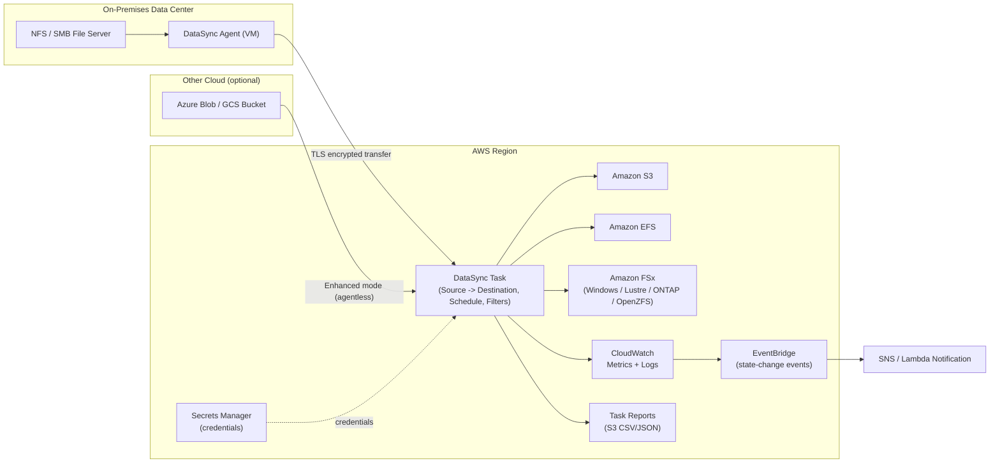

# AWS DataSync — Complete Service Notes (3.41)

> **Category:** Storage / Data Transfer & Migration
> **Console URL:** `https://console.aws.amazon.com/datasync/`
> **CLI namespace:** `aws datasync ...`

---

## 1. Overview

AWS DataSync is a fully managed, online data movement service that automates and accelerates copying files and objects between storage systems — on‑premises, edge devices, other clouds, and AWS storage services. It removes the operational burden of writing custom scripts, managing transfer agents manually, or building your own scheduling/retry logic.

**What DataSync handles for you:**
- Moving files and objects between source and destination
- Automatic scheduling of recurring transfers
- Encryption of data in transit (TLS) and verification of data integrity
- Bandwidth throttling so transfers don't saturate your network
- Filtering (include/exclude patterns) so only relevant data moves
- Monitoring through CloudWatch metrics, logs, and task reports
- Automatic retry/recovery from transient network failures

**Two task modes:**
- **Basic mode** — the original DataSync engine; broadly compatible across all location types; uses an on‑prem or EC2/cloud-deployed agent for non‑S3‑to‑S3 transfers.
- **Enhanced mode** — newer, agent‑less (for S3‑to‑S3 and most cross‑cloud transfers) or uses a special Enhanced‑mode agent for on‑prem NFS/SMB → S3; processes listing, transfer, and verification in parallel; removes the ~50‑million-file practical ceiling of Basic mode; gives richer per‑file metrics and automatically logs to a `/aws/datasync` CloudWatch log group.

**Typical use cases:**
- One‑time or recurring **migration** of on‑prem NAS/file server data into S3, EFS, or FSx
- **Hybrid cloud** workflows — continuously syncing on‑prem data with AWS for processing/analytics
- **Disaster recovery** — replicating data to AWS as a standby copy
- **Cloud‑to‑cloud** migration (e.g., Azure Blob → S3, Google Cloud Storage → S3)
- **Data lake ingestion** at scale (millions of small files, ML/AI training datasets)
- Archival / tiering data into S3 Glacier storage classes

---

## 2. Core Components

| Component | Description |
|---|---|
| **Agent** | A virtual machine (VM) or EC2 instance running DataSync software that reads from / writes to on‑prem, edge, or self‑managed/cloud storage that AWS can't reach directly. Not required for AWS‑to‑AWS transfers (S3, EFS, FSx) or for Enhanced‑mode agentless cross‑cloud transfers. |
| **Location** | An endpoint definition (source or destination) — e.g., NFS share, SMB share, HDFS cluster, self‑managed object storage, Azure Blob/Files, S3 bucket, EFS file system, FSx file system. Each location is created once and reused across tasks. |
| **Task** | The configuration object linking one source location to one destination location, plus options (transfer mode, verification mode, filters, schedule, bandwidth limit, logging). |
| **Task Execution** | A single run instance of a task. Each execution moves through phases: `LAUNCHING → PREPARING → TRANSFERRING → VERIFYING → SUCCESS/ERROR`. |
| **Task Report** | A detailed, exportable (CSV/JSON to S3) record of exactly what was transferred, skipped, deleted, or errored during an execution — used for compliance/audit. |
| **Filters (Include/Exclude)** | Pattern rules to limit which files/objects within a location are considered for transfer. |
| **Schedule** | A cron expression attached to a task so it runs automatically on a recurring basis. |

---

## 3. How to Create and Configure (GUI, then CLI)

> **Convention used throughout this document:** every operation is shown **first via the AWS Console (GUI)**, then the **equivalent AWS CLI command**.

### 3.1 Prerequisites
- An IAM role that DataSync can assume to read/write S3, EFS, or FSx (console can auto‑create this).
- Network connectivity: the agent's network must reach the source storage and outbound to AWS DataSync/S3/EC2 service endpoints (or via VPC endpoints for private connectivity).
- For on‑prem sources: a hypervisor (VMware ESXi, KVM, Hyper‑V) or EC2 to deploy the agent.

### 3.2 GUI — High-Level Setup Flow
1. Open the **AWS DataSync console**.
2. **Agents** (left nav) → **Create agent** (skip if transferring purely between AWS services like S3/EFS/FSx).
3. **Locations** (left nav) → **Create location** → choose source type → fill in connection details.
4. Repeat to create the **destination location**.
5. **Tasks** (left nav) → **Create task** → pick source location → pick destination location.
6. Configure **task options** (verification, transfer mode, bandwidth limit, schedule, filters, logging, task report).
7. Review and **Create task**.
8. Select the task → **Start** → **Start with defaults** (or override options) to launch an execution.
9. Monitor progress on the task execution detail page (live counters: files prepared, transferred, verified).

### 3.3 CLI — High-Level Setup Flow
```bash
# 1. Create an agent (only needed for on-prem/self-managed/cross-cloud sources)
aws datasync create-agent \
  --agent-name "onprem-agent-01" \
  --activation-key "<ACTIVATION_KEY_FROM_AGENT_VM>"

# 2. Create a source location (example: on-prem NFS)
aws datasync create-location-nfs \
  --server-hostname "nfs.example.local" \
  --subdirectory "/export/data" \
  --on-prem-config AgentArns="arn:aws:datasync:ap-south-1:111122223333:agent/agent-0123abcd"

# 3. Create a destination location (example: S3)
aws datasync create-location-s3 \
  --s3-bucket-arn "arn:aws:s3:::my-datasync-bucket" \
  --subdirectory "/imported/" \
  --s3-config BucketAccessRoleArn="arn:aws:iam::111122223333:role/DataSyncS3Role"

# 4. Create the task linking source -> destination
aws datasync create-task \
  --source-location-arn "arn:aws:datasync:ap-south-1:111122223333:location/loc-aaaa" \
  --destination-location-arn "arn:aws:datasync:ap-south-1:111122223333:location/loc-bbbb" \
  --name "onprem-to-s3-task" \
  --cloud-watch-log-group-arn "arn:aws:logs:ap-south-1:111122223333:log-group:/aws/datasync:*"

# 5. Start the task execution
aws datasync start-task-execution \
  --task-arn "arn:aws:datasync:ap-south-1:111122223333:task/task-cccc"
```

---

## 4. How to Use This Service Step by Step

1. **Identify source and destination** — what storage system holds the data today, and where should it end up in AWS?
2. **Deploy an agent** (if source/destination is outside direct AWS reach) on the same network segment as the storage.
3. **Activate the agent** by pairing it (via the agent's local web UI or CLI) with your AWS account using an activation key.
4. **Create locations** for both source and destination.
5. **Create a task** linking the two locations and set transfer behavior (full sync, changed‑only, verification level).
6. **Apply filters** to include/exclude specific folders, file types, or patterns if you don't want to move everything.
7. **Set bandwidth throttling** if running during business hours to protect production network bandwidth.
8. **Attach a schedule** if this should run automatically (hourly/daily/weekly/custom cron) — or leave unscheduled for manual/one‑time runs.
9. **Enable task reports** for an auditable record of every execution.
10. **Run the task** — manually the first time to validate, then let the schedule take over.
11. **Monitor** via the console execution view, CloudWatch metrics/alarms, and task reports.
12. **Iterate** — re‑run, adjust filters, or scale to additional agents for higher throughput as needed.

---

## 5. When to Use This Service

**Use DataSync when:**
- You need to move large volumes of files/objects (GBs to PBs) between on‑prem and AWS, or between two AWS services, with minimal custom engineering.
- You need recurring/incremental syncs (not just a one‑time copy).
- You need built‑in data integrity verification and detailed audit trails.
- Your source is NFS, SMB, HDFS, self‑managed object storage, or a supported cloud (Azure, Google Cloud, Wasabi, Backblaze, etc.).
- You want bandwidth‑aware, resumable, automatically‑retried transfers rather than `rsync`/`robocopy` scripts you have to babysit.

**Avoid / consider alternatives when:**
- Moving **petabytes over a very limited network link** with no time to wait → consider **AWS Snowball/Snowcone** (physical transfer) instead, or in combination with DataSync for the "last mile" delta sync.
- You need **database-level replication** (schema, transactions) → use **AWS DMS** (Database Migration Service), not DataSync (which is file/object level, not row/table level).
- You only need a **single, simple, ad‑hoc copy** of a few files → the S3 console upload, `aws s3 cp`/`sync`, or SFTP may be simpler than standing up DataSync infrastructure.
- You need **continuous block‑level replication** of an EC2 disk → look at AWS Elastic Disaster Recovery instead.

---

## 6. Agents

An **agent** is a purpose‑built virtual appliance that performs the actual read/write operations against storage DataSync can't reach natively (on‑prem NFS/SMB/HDFS, self‑managed object storage, most other clouds in Basic mode).

### Key facts
- Distributed as a VM image for **VMware ESXi, KVM, Microsoft Hyper‑V**, or can be launched as an **EC2 AMI** (useful for cloud‑to‑cloud transfers, e.g., agent in Azure/GCP, or agent in EC2 reading from a cloud‑native source via VPN/Direct Connect).
- Two agent variants: **Basic mode agent** and **Enhanced mode agent** (Enhanced agent is required specifically for on‑prem NFS/SMB ↔ S3 Enhanced‑mode tasks).
- No agent is needed for: S3 ↔ S3, S3 ↔ EFS, S3 ↔ FSx (AWS‑native locations), or Enhanced‑mode cross‑cloud transfers.
- Agents must be **activated** once — they call home to the DataSync service using an activation key generated either automatically (if the agent has internet access) or manually (offline/air‑gapped activation via the agent's local console).
- An agent can support **multiple tasks**; for very high throughput, you can associate **multiple agents** with a single NFS/SMB location to parallelize transfer.
- Agents send health/heartbeat data; if an agent goes offline, dependent tasks move to `UNAVAILABLE`.

### GUI — Create and Activate an Agent
1. Deploy the agent VM image (download `.ova`/`.vhd` or launch the EC2 AMI) on a host that can reach your storage.
2. Open the agent's local web UI (`http://<agent-ip>`) and note/generate the **activation key**.
3. In the **DataSync console** → **Agents** → **Create agent**.
4. Choose the deployment type (VM / EC2), paste the activation key, name the agent.
5. Optionally configure a **VPC endpoint** for private connectivity (no public internet egress).
6. Click **Create agent** — status should show `ONLINE`.

### CLI — Create and Manage Agents
```bash
# Create (activate) an agent
aws datasync create-agent \
  --agent-name "edge-agent-mumbai" \
  --activation-key "AAAA-BBBB-CCCC-DDDD" \
  --vpc-endpoint-id "vpce-0123456789abcdef0" \
  --subnet-arns "arn:aws:ec2:ap-south-1:111122223333:subnet/subnet-0aa1" \
  --security-group-arns "arn:aws:ec2:ap-south-1:111122223333:security-group/sg-0bb2"

# List all agents
aws datasync list-agents

# Check agent health/status
aws datasync describe-agent --agent-arn "arn:aws:datasync:ap-south-1:111122223333:agent/agent-0123abcd"

# Update agent name
aws datasync update-agent \
  --agent-arn "arn:aws:datasync:ap-south-1:111122223333:agent/agent-0123abcd" \
  --name "edge-agent-mumbai-renamed"

# Delete an agent
aws datasync delete-agent --agent-arn "arn:aws:datasync:ap-south-1:111122223333:agent/agent-0123abcd"
```

---

## 7. Transfer Tasks

A **task** ties a source location to a destination location and defines *how* the transfer behaves.

### Key options
| Option | Purpose |
|---|---|
| `TaskMode` | `BASIC` or `ENHANCED` |
| `TransferMode` | `CHANGED` (sync only deltas — default) or `ALL` (copy everything every run) |
| `VerifyMode` | `POINT_IN_TIME_CONSISTENT` (full re‑scan at end), `ONLY_FILES_TRANSFERRED` (verify just what moved), or `NONE` |
| `OverwriteMode` | Whether destination files with the same name get overwritten |
| `PreserveDeletedFiles` | Whether files deleted at source get deleted at destination too (mirrors vs. accumulates) |
| `Includes` / `Excludes` | Pattern‑based filters |
| `BytesPerSecond` | Bandwidth limit |
| `LogLevel` | `OFF`, `BASIC`, `TRANSFER` (verbosity sent to CloudWatch Logs) |

### GUI — Create a Task
1. **DataSync console** → **Tasks** → **Create task**.
2. **Configure source location** — select existing or create new.
3. **Configure destination location** — select existing or create new.
4. **Configure settings**: task mode, verification, transfer mode (full vs. changed), filters, bandwidth, queueing.
5. **Configure schedule** (optional): one‑time vs. recurring (with cron builder).
6. **Configure task report** (optional): destination S3 bucket + output format.
7. **Configure logging**: choose/create a CloudWatch log group.
8. **Review and create**.

### CLI — Create and Manage a Task
```bash
# Create a task with options
aws datasync create-task \
  --source-location-arn "arn:aws:datasync:ap-south-1:111122223333:location/loc-aaaa" \
  --destination-location-arn "arn:aws:datasync:ap-south-1:111122223333:location/loc-bbbb" \
  --name "finance-onprem-to-s3" \
  --task-mode "ENHANCED" \
  --options TransferMode=CHANGED,VerifyMode=ONLY_FILES_TRANSFERRED,OverwriteMode=ALWAYS,LogLevel=TRANSFER \
  --excludes '[{"FilterType":"SIMPLE_PATTERN","Value":"*/tmp/*|*.log"}]' \
  --cloud-watch-log-group-arn "arn:aws:logs:ap-south-1:111122223333:log-group:/aws/datasync:*"

# List tasks
aws datasync list-tasks

# Describe a task
aws datasync describe-task --task-arn "arn:aws:datasync:ap-south-1:111122223333:task/task-cccc"

# Update a task (e.g., change bandwidth limit)
aws datasync update-task \
  --task-arn "arn:aws:datasync:ap-south-1:111122223333:task/task-cccc" \
  --options BytesPerSecond=10485760

# Delete a task
aws datasync delete-task --task-arn "arn:aws:datasync:ap-south-1:111122223333:task/task-cccc"
```

---

## 8. Scheduling

Tasks can run **on demand** or on an **automatic recurring schedule** defined with a standard cron expression (same syntax family as EventBridge Scheduler).

### GUI — Add a Schedule
1. Open the task → **Edit** (or set during creation) → **Schedule** section.
2. Choose **Specify a schedule** → pick a frequency template (hourly/daily/weekly) or enter a **custom cron expression**, e.g. `cron(0 2 * * ? *)` for daily at 02:00 UTC.
3. Save. The console shows "Next scheduled run" once active.
4. To pause, edit the task and set schedule back to **No schedule**, or disable via status toggle.

### CLI — Add/Update a Schedule
```bash
aws datasync update-task \
  --task-arn "arn:aws:datasync:ap-south-1:111122223333:task/task-cccc" \
  --schedule ScheduleExpression="cron(0 2 * * ? *)"

# Remove a schedule (set to empty)
aws datasync update-task \
  --task-arn "arn:aws:datasync:ap-south-1:111122223333:task/task-cccc" \
  --schedule ScheduleExpression=""
```
**Note:** scheduled task executions still consume the "one execution at a time per task" rule — if a previous run hasn't finished, the schedule queues or skips depending on configuration.

---

## 9. Task Reports

Task reports give a **file‑by‑file audit trail** of an execution: what was transferred, skipped (already in sync), deleted, or errored — exported as CSV/JSON to an S3 bucket you specify. Useful for compliance (e.g., proving exactly which files moved during a migration window).

### GUI — Enable Task Reports
1. While creating/editing a task → **Task report** section → toggle **on**.
2. Choose the **destination S3 bucket** (and prefix) for reports.
3. Choose **report level**: summary only, or detailed (per‑file).
4. Choose **report output format**: CSV or JSON.
5. Choose which **report types** to generate (transferred files, skipped files, verified files, deleted files).
6. Save the task.

### CLI — Enable Task Reports
```bash
aws datasync update-task \
  --task-arn "arn:aws:datasync:ap-south-1:111122223333:task/task-cccc" \
  --task-report-config '{
    "Destination": {
      "S3": {
        "Subdirectory": "datasync-reports/",
        "BucketAccessRoleArn": "arn:aws:iam::111122223333:role/DataSyncReportRole",
        "S3BucketArn": "arn:aws:s3:::my-datasync-reports-bucket"
      }
    },
    "OutputType": "STANDARD",
    "ReportLevel": "SUCCESSES_AND_ERRORS",
    "ObjectVersionIds": "INCLUDE"
  }'
```
You can later query these reports at scale with **AWS Glue + Athena + QuickSight** to build dashboards of transfer history across many tasks.

---

## 10. Data Verification

DataSync checks that the destination matches the source after transfer, to guard against silent corruption.

| Mode | Behavior |
|---|---|
| `POINT_IN_TIME_CONSISTENT` | After transfer, DataSync re‑scans the **entire** source and destination to confirm full consistency. Default for Basic mode. Not usable when destination storage class is S3 Glacier Flexible Retrieval/Deep Archive. |
| `ONLY_FILES_TRANSFERRED` | Verifies only the files actually moved in this execution (faster, lighter). |
| `NONE` | No post‑transfer verification (fastest, least safe). |

Verification also happens continuously **in‑transit** using checksums, independent of which post‑transfer mode you pick.

### GUI
Set under task **Options → Data verification** dropdown during create/edit.

### CLI
```bash
aws datasync update-task \
  --task-arn "arn:aws:datasync:ap-south-1:111122223333:task/task-cccc" \
  --options VerifyMode=POINT_IN_TIME_CONSISTENT
```

---

## 11. Bandwidth Control

To avoid a transfer saturating a shared office/datacenter link, you can cap the throughput an agent/task uses.

### GUI
- Per‑task: Task **Options → Bandwidth limit (per task)** → enter a value in MiB/s.
- Per‑agent (global cap across all tasks on that agent): **Agent details → Bandwidth limit**.

### CLI
```bash
# Per-task limit (in Bytes/sec) — e.g., 5 MB/s
aws datasync update-task \
  --task-arn "arn:aws:datasync:ap-south-1:111122223333:task/task-cccc" \
  --options BytesPerSecond=5242880

# Per-execution override (only for that single run)
aws datasync start-task-execution \
  --task-arn "arn:aws:datasync:ap-south-1:111122223333:task/task-cccc" \
  --override-options BytesPerSecond=2097152
```

---

## 12. On‑Premises Transfers

Most common DataSync use case: migrate or continuously sync an on‑prem NAS/file server (NFS or SMB) to AWS.

### Requirements
- Deploy a DataSync **agent** VM on the same LAN (or with routed access) as the storage.
- Outbound network access from the agent to AWS DataSync endpoints, plus to S3/EFS/FSx endpoints (public internet, VPC endpoint, Direct Connect, or VPN — all supported).
- Read/list permissions on the NFS export or SMB share for the agent.

### GUI — Create an NFS Location
1. **Locations** → **Create location** → type **Network File System (NFS)**.
2. Select the **agent**, enter **server hostname/IP**, **export path** (subdirectory).
3. Set mount options if needed (NFS version, mount options string).
4. Create.

### CLI — Create an NFS Location
```bash
aws datasync create-location-nfs \
  --server-hostname "10.0.5.20" \
  --subdirectory "/export/finance" \
  --on-prem-config AgentArns="arn:aws:datasync:ap-south-1:111122223333:agent/agent-0123abcd" \
  --mount-options Version=NFS4_1
```

### GUI — Create an SMB Location
1. **Locations** → **Create location** → type **Server Message Block (SMB)**.
2. Select agent, enter server hostname, share name, domain, username/password (or Secrets Manager secret).
3. Create.

### CLI — Create an SMB Location
```bash
aws datasync create-location-smb \
  --server-hostname "fileserver01.corp.local" \
  --subdirectory "/Share/HR" \
  --agent-arns "arn:aws:datasync:ap-south-1:111122223333:agent/agent-0123abcd" \
  --user "svc-datasync" \
  --domain "CORP" \
  --password "<use-secrets-manager-in-production>"
```

---

## 13. S3 Transfers

S3 can be a **source or destination**. No agent is required when both sides are AWS‑native (S3 ↔ S3, S3 ↔ EFS, S3 ↔ FSx).

### GUI — Create an S3 Location
1. **Locations** → **Create location** → type **Amazon S3**.
2. Choose the **S3 bucket**, optional subfolder/prefix, and **storage class** to write objects as.
3. Choose/auto‑create the **IAM role** DataSync will assume (`AWSDataSyncFullAccess`-style policy scoped to the bucket).
4. Create.

### CLI — Create an S3 Location
```bash
aws datasync create-location-s3 \
  --s3-bucket-arn "arn:aws:s3:::corp-datalake-bucket" \
  --subdirectory "/raw/finance/" \
  --s3-config BucketAccessRoleArn="arn:aws:iam::111122223333:role/DataSyncS3Role" \
  --s3-storage-class "INTELLIGENT_TIERING"
```
**Notes:**
- DataSync **list, get, and put** requests against S3 incur standard S3 request charges — factor this into cost planning for very large file counts.
- Writing to **S3 Glacier Flexible Retrieval / Deep Archive** storage classes is supported but disables `POINT_IN_TIME_CONSISTENT` verification.

---

## 14. EFS Transfers

Amazon EFS (NFS‑based elastic file storage) is commonly used as both a migration target and a source for cross‑region/cross‑account EFS‑to‑EFS replication via DataSync.

### Requirements
- DataSync needs **mount target** access in the EFS file system's VPC — typically via an ENI DataSync creates in a subnet you specify, secured by a security group allowing NFS (port 2049).

### GUI — Create an EFS Location
1. **Locations** → **Create location** → type **Amazon EFS**.
2. Select the **EFS file system**, the **access point** (optional), the **VPC/subnet/security group** to mount through, and subdirectory.
3. Create.

### CLI — Create an EFS Location
```bash
aws datasync create-location-efs \
  --efs-filesystem-arn "arn:aws:elasticfilesystem:ap-south-1:111122223333:file-system/fs-0123abcd" \
  --subdirectory "/projects/" \
  --ec2-config SubnetArn="arn:aws:ec2:ap-south-1:111122223333:subnet/subnet-0aa1",SecurityGroupArns="arn:aws:ec2:ap-south-1:111122223333:security-group/sg-0bb2"
```

---

## 15. FSx Transfers

DataSync supports all four FSx file system types as locations:
- **FSx for Windows File Server** (SMB‑based) — great for migrating Windows file shares.
- **FSx for Lustre** — high‑performance computing/ML training data.
- **FSx for OpenZFS**
- **FSx for NetApp ONTAP**

### GUI — Create an FSx Location (example: Windows)
1. **Locations** → **Create location** → type **Amazon FSx for Windows File Server**.
2. Select the file system, provide domain/user credentials (or a Secrets Manager secret), VPC networking details, and subdirectory.
3. Create.

### CLI — Create FSx Locations
```bash
# FSx for Windows File Server
aws datasync create-location-fsx-windows \
  --fsx-filesystem-arn "arn:aws:fsx:ap-south-1:111122223333:file-system/fs-0456wxyz" \
  --subdirectory "/share" \
  --user "svc-datasync" --domain "CORP" --password "<use-secrets-manager>" \
  --security-group-arns "arn:aws:ec2:ap-south-1:111122223333:security-group/sg-0bb2"

# FSx for Lustre
aws datasync create-location-fsx-lustre \
  --fsx-filesystem-arn "arn:aws:fsx:ap-south-1:111122223333:file-system/fs-0789lus" \
  --subdirectory "/ml-data" \
  --security-group-arns "arn:aws:ec2:ap-south-1:111122223333:security-group/sg-0bb2"

# FSx for NetApp ONTAP
aws datasync create-location-fsx-ontap \
  --storage-virtual-machine-arn "arn:aws:fsx:ap-south-1:111122223333:storage-virtual-machine/svm-0abc" \
  --subdirectory "/vol1" \
  --protocol NFS={MountOptions={Version=NFS3}} \
  --security-group-arns "arn:aws:ec2:ap-south-1:111122223333:security-group/sg-0bb2"

# FSx for OpenZFS
aws datasync create-location-fsx-open-zfs \
  --fsx-filesystem-arn "arn:aws:fsx:ap-south-1:111122223333:file-system/fs-0zfs1" \
  --subdirectory "/data" \
  --protocol NFS={MountOptions={Version=AUTOMATIC}} \
  --security-group-arns "arn:aws:ec2:ap-south-1:111122223333:security-group/sg-0bb2"
```

---

## 16. Security

- **Encryption in transit:** all data moved by DataSync is encrypted using **TLS 1.2** between the agent and AWS, and between AWS services.
- **Encryption at rest:** inherited from the destination service (S3 SSE‑S3/SSE‑KMS, EFS encryption, FSx encryption).
- **IAM roles:** DataSync assumes a scoped IAM role to read/write S3 (and to publish CloudWatch logs); least‑privilege policies should restrict to the specific bucket/prefix.
- **Credentials for NFS/SMB/HDFS/Object Storage/FSx:** can be stored directly at location‑creation time, or centrally in **AWS Secrets Manager** (recommended) — Secrets Manager support now spans **all** location types, optionally encrypted with your own **KMS** key instead of the AWS‑owned default key.
- **Network isolation:** agents and AWS‑side locations (EFS/FSx) can be configured to use **VPC endpoints**, keeping traffic off the public internet.
- **IAM condition keys / SCPs:** can restrict who is allowed to create/start DataSync tasks, and which source/destination ARNs are permitted, at the organization level.
- **Resource‑level access control:** standard IAM policies scoped to specific agent, location, or task ARNs.
- **Logging for audit:** CloudTrail captures all DataSync API calls (`CreateTask`, `StartTaskExecution`, etc.) for governance.

---

## 17. Monitoring

| Tool | What it gives you |
|---|---|
| **DataSync console — Task execution view** | Live counters: files/objects prepared, transferred, verified, deleted; current phase; elapsed time. |
| **Amazon CloudWatch Metrics** | `BytesTransferred`, `FilesTransferred`, `BytesVerified`, `FilesVerified`, `BytesCompared`, `BytesWritten`, etc. — per task. |
| **CloudWatch Logs** | If `LogLevel=BASIC/TRANSFER`, every file event (or just errors) is logged to your chosen log group. |
| **CloudWatch Alarms** | Trigger on metric thresholds (e.g., zero bytes transferred for X minutes → possible stall) or on EventBridge task‑state‑change events. |
| **Amazon EventBridge** | DataSync emits events on task execution state changes (`SUCCESS`, `ERROR`) — can trigger Lambda/SNS notifications. |
| **Task Reports** | Per‑execution, per‑file audit detail exported to S3 (see Section 9). |

### GUI — View Monitoring
1. Open a task → **Executions** tab → click an execution for the live/historical progress view and final summary.
2. **CloudWatch console** → **Metrics → DataSync** namespace, or **Logs → log group** to view detailed events.

### CLI — Pull Monitoring Data
```bash
# List executions for a task
aws datasync list-task-executions --task-arn "arn:aws:datasync:ap-south-1:111122223333:task/task-cccc"

# Describe a specific execution (status + counters)
aws datasync describe-task-execution \
  --task-execution-arn "arn:aws:datasync:ap-south-1:111122223333:task/task-cccc/execution/exec-0001"

# Pull CloudWatch metric data (example: BytesTransferred)
aws cloudwatch get-metric-statistics \
  --namespace "AWS/DataSync" \
  --metric-name "BytesTransferred" \
  --dimensions Name=TaskId,Value=task-cccc \
  --start-time 2026-06-19T00:00:00Z --end-time 2026-06-20T00:00:00Z \
  --period 3600 --statistics Sum
```

---

## 18. Troubleshooting

| Symptom | Likely Cause | Fix |
|---|---|---|
| Task stuck in `CREATING` | Agent can't mount source NFS share | Check firewall (port 2049), correct hostname, export permissions |
| Task status `UNAVAILABLE` | Associated agent is offline | Check agent VM/EC2 power state, network path, re‑activate if needed |
| `AccessDenied` writing to S3 | IAM role missing permissions on bucket/prefix | Attach/expand `BucketAccessRoleArn` policy |
| SMB authentication failures | Wrong domain/user/password or expired credential | Re‑enter credentials, prefer Secrets Manager with rotation |
| Transfer is very slow | Bandwidth throttle set too low, single agent bottleneck, high file‑count overhead in Basic mode | Raise/remove `BytesPerSecond`, add agents for parallelism, switch to Enhanced mode for huge file counts |
| Verification fails / mismatched files | Source changed mid‑transfer, clock skew, partial network failure | Re‑run task; use `ONLY_FILES_TRANSFERRED` to isolate; check source stability |
| Files not deleted at destination despite being deleted at source | `PreserveDeletedFiles` not configured to `REMOVE` | Update task option to delete files that no longer exist at source |
| Execution stuck in `PREPARING` for a long time | Extremely large directory listing, agent under‑resourced | Check agent CPU/network metrics; consider Enhanced mode |
| Activation key invalid/expired | Generated too long ago or agent clock drift | Regenerate activation key from the agent's local UI |

---

## 19. Interview Questions

1. **What is AWS DataSync and how does it differ from `aws s3 sync`?**
   DataSync is a managed transfer service with built‑in agents, scheduling, bandwidth control, integrity verification, and reporting; `aws s3 sync` is a manual CLI copy command with no agent, no scheduling engine, and no formal task reporting.

2. **When would you need a DataSync agent, and when not?**
   Needed when the source/destination is outside AWS's direct reach (on‑prem NFS/SMB/HDFS, self‑managed object storage, most other clouds in Basic mode). Not needed for S3↔S3, S3↔EFS, S3↔FSx, or agentless Enhanced‑mode cross‑cloud transfers.

3. **Difference between Basic mode and Enhanced mode?**
   Enhanced mode parallelizes listing/transfer/verification, removes the practical file‑count ceiling, gives richer metrics, and is agentless for many paths; Basic mode is the original engine with broader location‑type coverage and requires an agent for non‑S3‑native paths.

4. **How does DataSync ensure data integrity?**
   In‑transit checksums during transfer, plus configurable post‑transfer verification (`POINT_IN_TIME_CONSISTENT` full re‑scan, or `ONLY_FILES_TRANSFERRED` partial check).

5. **How would you migrate a 50 TB on‑prem file server to S3 with minimal downtime?**
   Deploy a DataSync agent on‑prem, create NFS/SMB source location and S3 destination location, run an initial full sync ahead of cutover, then schedule incremental (`CHANGED`) syncs close to cutover, and do a final small delta sync during the maintenance window before switching workloads to S3.

6. **How do you control DataSync's network impact during business hours?**
   Apply a `BytesPerSecond` bandwidth limit at the task or agent level, and/or schedule transfers for off‑peak hours.

7. **What's the difference between DataSync and DMS?**
   DataSync moves files/objects at the storage layer; DMS replicates structured database data (schemas, tables, transactions) between database engines.

8. **How do you audit exactly what was copied during a migration?**
   Enable **task reports**, which export a detailed CSV/JSON manifest of transferred/skipped/deleted/errored files to S3 per execution; can be queried at scale with Glue/Athena/QuickSight.

9. **Can DataSync delete files at the destination that were removed at the source?**
   Yes, when `PreserveDeletedFiles` is set to remove/disabled (mirrored sync) — otherwise destination files accumulate even after source deletion.

10. **How do you secure credentials for an SMB or NFS source?**
    Store them in **AWS Secrets Manager** (optionally KMS‑encrypted with a customer‑managed key) rather than embedding plaintext credentials directly in the location configuration.

---

## 20. Enterprise‑Level Project — Demo (GUI + CLI)

### Scenario
A bank's on‑prem data center holds a Windows file share (SMB) with regulatory documents (≈10 TB). Compliance requires: (a) a one‑time historical migration into S3 with full audit trail, (b) nightly incremental sync going forward, (c) network usage capped during business hours, (d) encrypted credentials, (e) alerting on failures.

### Step 1 — Deploy and activate the agent
**GUI:**
1. Download the DataSync VM image for VMware (or launch the EC2 AMI in a connected VPC if the source is reachable via VPN/Direct Connect).
2. Deploy on a host with network access to the file server.
3. Open agent local UI, copy the **activation key**.
4. **DataSync console → Agents → Create agent**, paste key, name it `bank-onprem-agent`.

**CLI:**
```bash
aws datasync create-agent \
  --agent-name "bank-onprem-agent" \
  --activation-key "WXYZ-1234-ABCD-5678"
```

### Step 2 — Store credentials securely
**GUI:** AWS Secrets Manager console → **Store a new secret** → "Other type of secret" → enter SMB username/password → name it `datasync/bank-smb-creds` → encrypt with a customer‑managed KMS key.

**CLI:**
```bash
aws secretsmanager create-secret \
  --name "datasync/bank-smb-creds" \
  --kms-key-id "alias/datasync-key" \
  --secret-string '{"username":"svc-datasync","password":"<strong-password>"}'
```

### Step 3 — Create source (SMB) and destination (S3) locations
**GUI:** DataSync console → Locations → Create location → SMB (point credentials to the Secrets Manager secret) → then Create location → S3 (point to `bank-compliance-archive` bucket, prefix `regulatory-docs/`, role `DataSyncBankS3Role`, storage class `STANDARD_IA`).

**CLI:**
```bash
aws datasync create-location-smb \
  --server-hostname "fileserver-prod.bank.local" \
  --subdirectory "/Share/Compliance" \
  --agent-arns "arn:aws:datasync:ap-south-1:111122223333:agent/agent-bank01" \
  --credentials-secret-arn "arn:aws:secretsmanager:ap-south-1:111122223333:secret:datasync/bank-smb-creds-AbCdEf"

aws datasync create-location-s3 \
  --s3-bucket-arn "arn:aws:s3:::bank-compliance-archive" \
  --subdirectory "/regulatory-docs/" \
  --s3-config BucketAccessRoleArn="arn:aws:iam::111122223333:role/DataSyncBankS3Role" \
  --s3-storage-class "STANDARD_IA"
```

### Step 4 — Create the task with compliance‑grade options
**GUI:** Tasks → Create task → select source/destination → Options: Verify = `POINT_IN_TIME_CONSISTENT`, Transfer mode = `CHANGED`, Bandwidth limit = `15 MiB/s`, Log level = `TRANSFER` → Task report = ON, output to `bank-datasync-reports` bucket → Schedule = `cron(0 1 * * ? *)` (1 AM nightly).

**CLI:**
```bash
aws datasync create-task \
  --source-location-arn "arn:aws:datasync:ap-south-1:111122223333:location/loc-smb01" \
  --destination-location-arn "arn:aws:datasync:ap-south-1:111122223333:location/loc-s3archive" \
  --name "bank-compliance-nightly-sync" \
  --options TransferMode=CHANGED,VerifyMode=POINT_IN_TIME_CONSISTENT,BytesPerSecond=15728640,LogLevel=TRANSFER \
  --schedule ScheduleExpression="cron(0 1 * * ? *)" \
  --cloud-watch-log-group-arn "arn:aws:logs:ap-south-1:111122223333:log-group:/aws/datasync:*" \
  --task-report-config '{
    "Destination": {"S3": {"S3BucketArn":"arn:aws:s3:::bank-datasync-reports","Subdirectory":"nightly/","BucketAccessRoleArn":"arn:aws:iam::111122223333:role/DataSyncReportRole"}},
    "OutputType": "STANDARD", "ReportLevel": "SUCCESSES_AND_ERRORS"
  }'
```

### Step 5 — Run the initial historical migration manually
**GUI:** Select task → **Start** → **Start with override options** → set `BytesPerSecond` higher temporarily for the one‑off bulk load (e.g., outside business hours) → confirm.

**CLI:**
```bash
aws datasync start-task-execution \
  --task-arn "arn:aws:datasync:ap-south-1:111122223333:task/task-banknightly" \
  --override-options BytesPerSecond=104857600
```

### Step 6 — Alert on failures
**GUI:** EventBridge console → **Create rule** → event source "DataSync Task Execution State Change" with state `ERROR` → target: SNS topic `bank-datasync-alerts` (subscribed by ops team email/Slack).

**CLI:**
```bash
aws events put-rule \
  --name "datasync-task-failures" \
  --event-pattern '{"source":["aws.datasync"],"detail-type":["DataSync Task Execution State Change"],"detail":{"State":["ERROR"]}}'

aws events put-targets \
  --rule "datasync-task-failures" \
  --targets "Id"="1","Arn"="arn:aws:sns:ap-south-1:111122223333:bank-datasync-alerts"
```

### Step 7 — Validate with task reports and query history
**GUI:** S3 console → `bank-datasync-reports` bucket → download/preview the CSV for the night's run; or use Athena (after a Glue crawler) to query historical pass/fail rates across months.

**CLI:**
```bash
aws s3 ls s3://bank-datasync-reports/nightly/ --recursive
aws athena start-query-execution \
  --query-string "SELECT status, count(*) FROM datasync_reports GROUP BY status" \
  --result-configuration OutputLocation=s3://bank-athena-results/
```

### Outcome
Compliance gets a fully audited, encrypted, bandwidth‑respectful nightly sync with automated failure alerting — built without any custom transfer scripts.

---

## 21. Quick Revision Sheet

- **Service type:** Managed online data transfer (files/objects), not database replication.
- **Core objects:** Agent → Location (source/destination) → Task → Task Execution → Task Report.
- **Modes:** Basic (broad compatibility, agent‑based) vs Enhanced (faster, parallel, often agentless, no practical file‑count ceiling).
- **Agent needed?** Yes for on‑prem NFS/SMB/HDFS/self‑managed object storage and most Basic‑mode cross‑cloud. No for S3↔S3/EFS/FSx or Enhanced‑mode agentless cross‑cloud.
- **Supported location types:** NFS, SMB, HDFS, self‑managed object storage, other‑cloud object/file storage (Azure Blob/Files, Google Cloud Storage, Wasabi, etc.), S3, EFS, FSx (Windows/Lustre/OpenZFS/ONTAP).
- **Transfer modes:** `CHANGED` (incremental, default) vs `ALL` (full copy every run).
- **Verification:** `POINT_IN_TIME_CONSISTENT` (full), `ONLY_FILES_TRANSFERRED` (partial), `NONE`.
- **Scheduling:** Cron‑based, attached directly to a task.
- **Bandwidth control:** Per‑task and per‑agent `BytesPerSecond` cap.
- **Security:** TLS in transit; destination‑native encryption at rest; IAM role for AWS‑side access; Secrets Manager (+ optional customer KMS key) for source credentials across all location types.
- **Monitoring:** Console execution view, CloudWatch metrics/logs, EventBridge state‑change events, Task Reports (S3 CSV/JSON).
- **Common alternatives:** Snowball/Snowcone (offline/physical bulk transfer), DMS (databases), `aws s3 sync` (simple ad‑hoc one‑offs), Elastic Disaster Recovery (block‑level continuous replication).
- **Key CLI commands:** `create-agent`, `create-location-*`, `create-task`, `update-task`, `start-task-execution`, `describe-task-execution`, `list-task-executions`.

---

## 22. Architecture Diagram



**Flow explanation:**
1. On‑prem storage is read by a DataSync **agent**, which encrypts data in transit (TLS) and sends it to the DataSync **task** engine in AWS.
2. Cross‑cloud sources can connect directly in **Enhanced mode** without an agent.
3. Credentials for non‑AWS sources are pulled securely from **Secrets Manager**.
4. The task writes data into the chosen AWS destination — **S3**, **EFS**, or **FSx**.
5. Every execution emits metrics/logs to **CloudWatch** and a detailed **task report** to S3.
6. **EventBridge** reacts to execution state changes (success/error) and can fan out to **SNS/Lambda** for alerting and automation.

---
*Notes compiled for AWS Service 3.41 — AWS DataSync.*
